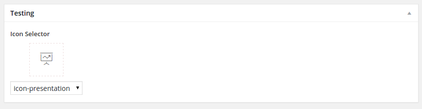

# ACF Icon Selector Field

An font icon selector field that lets you preview a font icon.

### Compatibility

This ACF field type is compatible with:
* ACF 5

### Installation

1. Copy the `acf-field-icon-font` folder into your `wp-content/plugins` folder
2. Activate the Icon Font Field plugin via the plugins admin page
3. Create a new field via ACF and select the icon font type
4. Please refer to the description for more info regarding the field type settings

### Setup

1. Replace the content of `css/et-line.css` with the css provided from your icon font.
3. Replace the current font icon in the `fonts/` folder, with the icon font you want to use.
2. Add the css classes provided by the font to the `font-info.json` file replace the iconClasses list.
